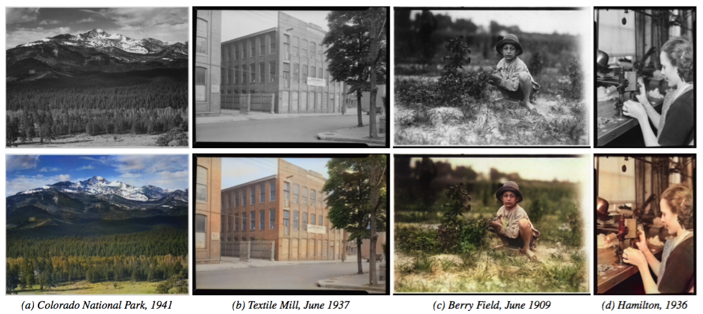
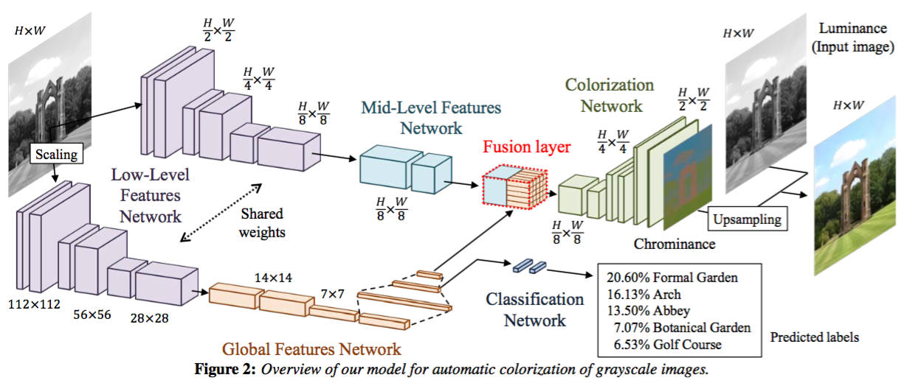

The Image Colorization Network
==============================




The Tensorflow version of the [ColorNet](http://hi.cs.waseda.ac.jp/~iizuka/projects/colorization/en/) issued on SIGGRAPH 2016. Please check out the original website for the details.

They have done the good job and provide the implementation of Torch version. I know nothing about the Torch but I know a bit of Tensorflow, so this is for the Tensorflow developers. The project is still on going, feel free to contribute it.

TODO
====

- Finish the loss function.
- Verify every network components, check the ranks of the tensors are matched.
- Write the training codes and testing codes.
- Collect the training data set and validation set.

Author
======

```
@Article{IizukaSIGGRAPH2016,
  author = {Satoshi Iizuka and Edgar Simo-Serra and Hiroshi Ishikawa},
  title = {{Let there be Color!: Joint End-to-end Learning of Global and Local Image Priors for Automatic Image Colorization with Simultaneous Classification}},
  journal = "ACM Transactions on Graphics (Proc. of SIGGRAPH 2016)",
  year = 2016,
  volume = 35,
  number = 4,
}
```
